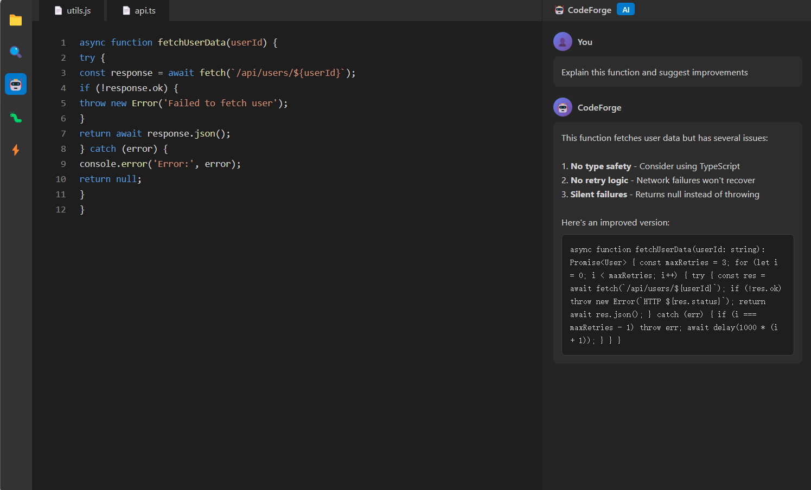

# 🤖 CodeForge

> 开源的 AI 编程助手，VSCode 插件

<p align="center">
  
</p>

---

## ✨ 功能特性

### 🎯 AI 辅助编程
- **代码生成** - 根据描述自动生成代码
- **代码解释** - 解释选中代码的含义
- **代码审查** - 发现潜在问题和优化建议
- **代码重构** - 自动重构和改进代码

### 🌍 多语言支持
- 中文 / English
- 根据 VSCode 语言自动切换

### 📊 使用统计
- 总请求数
- Token 使用量
- 各功能使用次数

### ⚡ 性能优化
- 响应缓存
- 取消操作支持
- 错误重试机制

---

## 🚀 快速开始

### 安装

```bash
cd codeforge
npm install
```

### 编译

```bash
npm run compile
```

### 运行

在 VSCode 中：
1. 按 `F5` 打开扩展开发窗口
2. 配置 OpenAI API Key
3. 开始使用

---

## 📖 使用指南

### 配置 API Key

1. 打开 VSCode 设置
2. 搜索 "CodeForge"
3. 填入 OpenAI API Key

### 快捷键

| 功能 | Windows/Linux | Mac |
|------|---------------|-----|
| 生成代码 | `Ctrl+Shift+G` | `Cmd+Shift+G` |
| 解释代码 | `Ctrl+Shift+E` | `Cmd+Shift+E` |

### 命令面板

按 `Ctrl+Shift+P` (Mac: `Cmd+Shift+P`)，输入：
- `CodeForge: Generate Code` - 生成代码
- `CodeForge: Explain Code` - 解释代码
- `CodeForge: Review Code` - 审查代码
- `CodeForge: Refactor Code` - 重构代码
- `CodeForge: View Statistics` - 查看统计

---

## 🛠️ 技术栈

- **语言**: TypeScript
- **框架**: VSCode Extension API
- **AI**: OpenAI API
- **HTTP**: Node.js https 模块

---

## 📁 项目结构

```
codeforge/
├── src/
│   ├── extension.ts    # 主扩展代码
│   └── i18n.ts        # 多语言支持
├── out/               # 编译输出
├── package.json       # 扩展配置
└── README.md
```

---

## 🔧 配置项

在 VSCode 设置中配置：

```json
{
  "codeforge.apiKey": "your-openai-api-key",
  "codeforge.model": "gpt-3.5-turbo",
  "codeforge.temperature": 0.7,
  "codeforge.cacheEnabled": true,
  "codeforge.showStats": true
}
```

---

## 🐛 常见问题

### 如何获取 OpenAI API Key？

访问 https://platform.openai.com/api-keys 创建

### 支持哪些模型？

- gpt-3.5-turbo (推荐)
- gpt-4
- gpt-4-turbo-preview

### 代码生成失败？

1. 检查 API Key 是否正确
2. 检查网络连接
3. 查看 VSCode 输出面板中的错误信息

---

## 📄 许可证

[MIT](../LICENSE) © tinyfish

---

<p align="center">
  <a href="https://github.com/Y1-q-1Q/devforge">← 返回 DevForge</a>
</p>