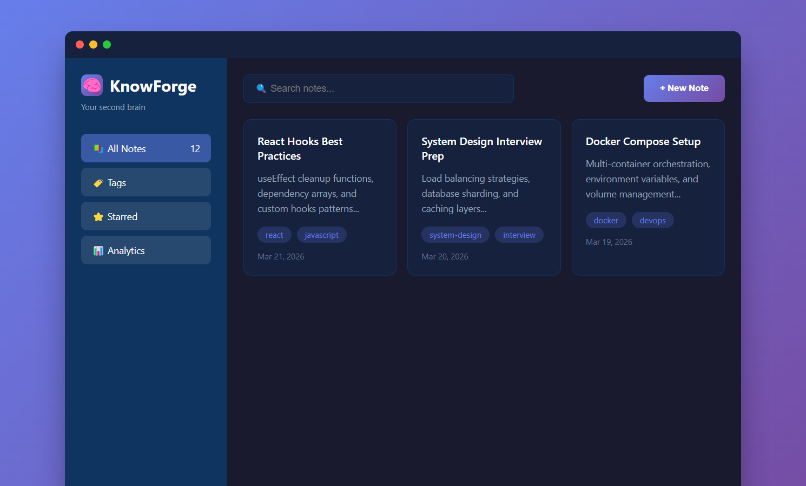

# 🧠 KnowForge

> 你的第二大脑，专为开发者设计的知识管理系统

<p align="center">
  
</p>

---

## ✨ 功能特性

### 📝 笔记管理
- 创建、编辑、删除笔记
- 支持 Markdown 格式
- 全文搜索
- 标签分类

### 🌍 多语言支持
- 中文 / English
- 一键切换
- 自动保存语言偏好

### 🎨 个性化主题
- 深色模式
- 浅色模式
- 跟随系统

### ⚙️ 自定义设置
- 字体大小调节
- 侧边栏宽度
- 自动保存

### 💾 数据安全
- 本地 JSON 存储
- 自动备份（保留10个版本）
- 数据导入/导出
- 隐私优先

---

## 🚀 快速开始

### 安装

```bash
cd knowforge
npm install
```

### 启动

```bash
npm start
```

访问 http://localhost:3000

---

## 📖 使用指南

### 创建笔记

1. 点击左侧「新建笔记」按钮
2. 输入标题和内容
3. 添加标签（可选）
4. 点击保存

### 搜索笔记

在顶部搜索框输入关键词，支持：
- 标题搜索
- 内容搜索
- 标签搜索

### 切换语言

1. 点击左下角「设置」按钮
2. 选择「语言」
3. 选择中文或 English

### 切换主题

1. 点击左下角「设置」按钮
2. 选择「主题」
3. 选择深色或浅色

### 数据导入/导出

**导出**:
- 点击顶部「导出」按钮
- 下载 JSON 文件

**导入**:
- 点击顶部「导入」按钮
- 选择之前导出的 JSON 文件

---

## 🛠️ 技术栈

- **前端**: HTML5 + TailwindCSS + Vanilla JS
- **后端**: Node.js + Express
- **存储**: JSON 文件
- **图标**: Font Awesome

---

## 📁 项目结构

```
knowforge/
├── public/
│   └── index.html      # 前端界面
├── src/
│   ├── i18n/          # 多语言文件
│   │   ├── en.json
│   │   ├── zh.json
│   │   └── index.js
│   └── config/        # 配置管理
│       └── index.js
├── server.js          # Express 服务器
├── package.json
└── README.md
```

---

## 🔧 配置说明

配置文件保存在 `user-config.json`:

```json
{
  "language": "zh",
  "theme": "dark",
  "fontSize": 14,
  "autoSave": true,
  "backupCount": 10
}
```

---

## 🐛 常见问题

### 如何备份数据？

数据自动备份在 `backups/` 目录，保留最近10个版本。

### 如何恢复误删的笔记？

从 `backups/` 目录找到最近的备份文件，使用导入功能恢复。

### 支持哪些浏览器？

- Chrome 90+
- Firefox 88+
- Edge 90+
- Safari 14+

---

## 📄 许可证

[MIT](../LICENSE) © tinyfish

---

<p align="center">
  <a href="https://github.com/Y1-q-1Q/devforge">← 返回 DevForge</a>
</p>